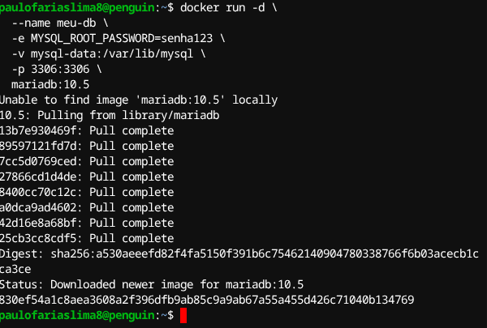

# DesafioDockerCompassUol
 
*Paulo Farias Lima*


Abaixo segue os exercicios propostos no desafio de Docker do Programa de Bolsa de Estágio de DevSecOps da Compass Uol.

## Exercício 1.
1. Crie um arquivo Dockerfile que utilize a imagem alpine como base e
imprima a mensagem: "Olá, Docker!" ao ser executada. Construa a imagem
com o nome meu-echo e execute um container a partir dela. 

**1º. Passo: Instalar o Docker na máquina.**

Digite no seu terminal linux de base Debian:

 `sudo apt install docker.io -y`

**2º. Passo: Verificar se o docker foi instalado.**

Digite no seu terminal linux de base Debian:

`docker --version`

deve retornar algo como:


**3º. Passo: Criar o arquivo Dockerfile.**

Abra seu editor de texto prefencial e escreva o seguinte conteúdo:

```
FROM alpine:latest 
RUN echo "Criando a imagem"
CMD echo "Olá, Docker!"
```
Obs! O arquivo Dockerfile também está disponivel na pasta Exercicio1.

**4º. Passo: Salvar o arquivo Dockerfile e Buildar a imagem.**

Salve o arquivo como `Dockerfile` e execute o seguinte comando no terminal:

```
docker build -t meu-echo .
```
Deve retornar algo como:


**5º. Passo: Executar o container.**
Execute o seguinte comando no terminal:

```
sudo docker run meu-echo
```
Resultado esperado:


---

## Exercício 2.
Crie um container com Nginx que sirva uma página HTML customizada
(index.html). Monte um volume local com esse arquivo para que ele
apareça na raiz do site (/usr/share/nginx/html). Acesse a página via
http://localhost.

**1º. Passo: Criar o arquivo index.html e a Pasta Meu-Nginx no Diretorio Home.** 

Aqui sera reultilizado o index.html do desafio anterior do WebHook, os arquivos estão disponiveis na pasta Exercicio2.


**2º. Criar o arquivo Dockerfile com a imagem do Nginx.**

```
FROM nginx:latest
COPY index.html /usr/share/nginx/html/
EXPOSE 8080
```
Salve o arquivo e execulte o comando abaixo no terminal na mesma pasta em que está o arquivo Dockerfile:

```
sudo docker build -t nginx .
```


**3º. Execultar a imagem docker com o volume montado na pasta home para poder exibir o site.**

Abra o terminal fora da pasta que contem o arquivo dockerfile e execulte o comando abaixo.

```
docker run -d \
  --name meu-nginx-container \
  -p 8080:80 \
  -v ~/meu-nginx:/usr/share/nginx/html \
  meu-nginx
```
Se o comando funcionar a saida deve ser igual a imagem abaixo:


**3º. Abrir um localhost no navegador.**

A imagem docker foi muntada para ser iniciada na porta local 8080.

http://localhost:8080/


---

## Exercicio 3.
Inicie um container da imagem ubuntu com um terminal interativo (bash). Navegue pelo sistema de arquivos e instale o pacote curl utilizando apt.

**1º. Passo: Criar o imagem do Ubunto no Docker.**

Abra o terminal e digite o seguinte codigo:

```
docker run -it --name meu-ubuntu ubuntu bash
```

A saida deve ser conforme a imagem abaixo:


Note que no terminal o usuario mudou para: root@24ca62acc575.

**2º. Passo: Atualizar as bibliotecas e dependencias.**

O proximo comando é para atualizar os repositorios para depois inicarmos outro comando para baixar o CURL.
```
sudo apt-get upgrade
```
ou 
```
apt-get upgrade
```


agora digite o comando abaixo para atualizar a lista de pacotes:
```
apt-get update
```

**3º. Passo: Instalar o CURL**

Agora o proximo comando será:

```
apt-get install curl
```
ou 

```
sudo apt-get install curl
```


---

## Exercício 4.
Suba um container do MySQL (pode usar a imagem mysql:5.7), utilizando um volume nomeado para armazenar os dados. Crie um banco de dados, pare o container, suba novamente e verifique se os dados persistem.

**1º. Passo: Criar a imagem docker.**

Abra o terminal e digite:

```
sudo docker volume create mysql-data
```
Depois o terminal deve exibir msql-data.

**2º. Passo: Iniciar o Conteiner**

Digite o codigo abaixo no terminal:

```
sudo docker run -d \
  --name meu-db \
  -e MYSQL_ROOT_PASSWORD=senha123 \
  -v mysql-data:/var/lib/mysql \
  -p 3306:3306 \
  mariadb:10.5
```
A saida no terminal deve ser igual a imagem abaixo:


**3º. Passo: Criar o Banco de Dados.**

Digite o comando abaixo no terminal:
```
sudo docker exec -it meu-db mysql -uroot
```
Assim deve ser a saida no terminal com o Welcome Maria DB. 


---

## Exercício 5.
Crie um container com a imagem alpine passando uma variável de ambiente chamada MEU_NOME com seu nome. Execute o container e imprima o valor da variável com o comando echo.

**1º. Passo: Executar o container com a variável de ambiente**

No terminal, execute:

```
docker run --rm -e MEU_NOME="Paulo Farias Lima" alpine sh -c 'echo $MEU_NOME'
```

O resultado esperado é:

```
Paulo Farias Lima
```

---

## Exercício 6.
Utilize um multi-stage build para otimizar uma aplicação Go, reduzindo o tamanho da imagem final. Utilize para praticar o projeto GS PING desenvolvido em Golang.

**1º. Passo: Criar o Dockerfile multi-stage**

Exemplo de Dockerfile:

```
FROM golang:1.21-alpine AS builder
WORKDIR /app
COPY . .
RUN go build -o gsping

FROM alpine:latest
WORKDIR /app
COPY --from=builder /app/gsping .
CMD ["./gsping"]
```

**2º. Passo: Buildar e rodar a imagem**

```
docker build -t gsping .
docker run --rm gsping
```

---

## Exercício 7.
Crie uma rede Docker personalizada e faça dois containers, um Node.js e um MongoDB, se comunicarem. Sugestão: utilize o projeto React Express + Mongo.

**1º. Passo: Criar a rede**

```
docker network create minha-rede
```

**2º. Passo: Subir o MongoDB**

```
docker run -d --name meu-mongo --network minha-rede mongo
```

**3º. Passo: Subir o Node.js**

```
docker run -d --name meu-node --network minha-rede -e MONGO_URL="mongodb://meu-mongo:27017/meubanco" meu-node-app
```

---

## Exercício 8.
Utilize Docker Compose para configurar uma aplicação com um banco de dados PostgreSQL, use para isso o projeto pgadmin.

**1º. Passo: Criar o arquivo docker-compose.yml**

```yaml
version: '3'
services:
  db:
    image: postgres
    environment:
      POSTGRES_PASSWORD: senha123
    ports:
      - "5432:5432"
  pgadmin:
    image: dpage/pgadmin4
    environment:
      PGADMIN_DEFAULT_EMAIL: admin@admin.com
      PGADMIN_DEFAULT_PASSWORD: admin
    ports:
      - "5050:80"
```

**2º. Passo: Subir os serviços**

```
docker-compose up -d
```

Acesse o pgAdmin em http://localhost:5050.

---

## Exercício 9.
Construa uma imagem baseada no Nginx ou Apache, adicionando um site HTML/CSS estático. Utilize a landing page do Creative Tim para criar uma página moderna hospedada no container.

**1º. Passo: Criar o Dockerfile**

```
FROM nginx:latest
COPY . /usr/share/nginx/html
```

**2º. Passo: Buildar e rodar a imagem**

```
docker build -t minha-landing .
docker run -d -p 8080:80 minha-landing
```

Acesse em http://localhost:8080.

---

## Exercício 10.
Crie um Dockerfile para uma aplicação simples e configure para rodar com usuário não-root.

**1º. Passo: Exemplo de Dockerfile**

```
FROM node:18-alpine
WORKDIR /app
COPY . .
RUN adduser -D appuser
USER appuser
CMD ["node", "app.js"]
```

**2º. Passo: Buildar e rodar**

```
docker build -t node-nonroot .
docker run --name meu-node -d node-nonroot
docker exec -it meu-node whoami
```

O comando acima deve retornar `appuser`.

---

## Exercício 11.
Trivy é uma ferramenta open source para análise de vulnerabilidades em imagens Docker.

**1º. Passo: Instalar o Trivy**

```
sudo apt install wget -y
wget https://github.com/aquasecurity/trivy/releases/latest/download/trivy_0.50.1_Linux-64bit.deb
sudo dpkg -i trivy_0.50.1_Linux-64bit.deb
```

**2º. Passo: Rodar análise**

Execute o comando abaixo para analisar a imagem python:3.9:

```
trivy image python:3.9
```

**3º. Passo: Identificar vulnerabilidades HIGH ou CRITICAL**

Exemplo de saída (resumida) do Trivy para a imagem `python:3.9`:

```
python:3.9 (debian 11.7)
=========================
Total: 20 (HIGH: 4, CRITICAL: 2)

+---------------------+------------------+----------+-------------------+---------------+---------------------------------------+
|    LIBRARY          | VULNERABILITY ID | SEVERITY | INSTALLED VERSION | FIXED VERSION |             TITLE                     |
+---------------------+------------------+----------+-------------------+---------------+---------------------------------------+
| openssl             | CVE-2023-0464    | HIGH     | 1.1.1n-0+deb11u3  | 1.1.1n-0+deb11u4| openssl: possible DoS via invalid...  |
| glibc               | CVE-2023-25139   | HIGH     | 2.31-13+deb11u6   | 2.31-13+deb11u7| glibc: buffer overflow in getcwd...   |
| libexpat1           | CVE-2022-40674   | CRITICAL | 2.2.10-2+deb11u2  | 2.2.10-2+deb11u3| expat: heap buffer overflow           |
| python3.9           | CVE-2023-24329   | HIGH     | 3.9.2-1           | 3.9.2-2       | python: urlparse improper handling... |
| ...                 | ...              | ...      | ...               | ...           | ...                                   |
+---------------------+------------------+----------+-------------------+---------------+---------------------------------------+
```

**Principais vulnerabilidades encontradas:**

- `CVE-2023-0464` (openssl): possível DoS via entrada inválida.
- `CVE-2023-25139` (glibc): buffer overflow em getcwd.
- `CVE-2022-40674` (libexpat1): heap buffer overflow (CRITICAL).
- `CVE-2023-24329` (python3.9): urlparse tratamento inadequado de URLs.

**Sugestões de correção:**

- Atualizar a imagem base para uma versão mais recente e corrigida, por exemplo, `python:3.9-slim-bullseye` ou uma versão mais nova do Python.
- Sempre rodar `apt-get update && apt-get upgrade -y` no Dockerfile para garantir que os pacotes estejam atualizados.
- Monitorar periodicamente as imagens utilizadas com o Trivy ou outra ferramenta de análise.
- Se possível, utilize imagens oficiais com a tag `-slim` ou `-alpine`, que possuem menos dependências e menor superfície de ataque.
- Remover dependências desnecessárias do seu projeto para reduzir o número de pacotes vulneráveis.

**Exemplo de Dockerfile melhorado:**

```
FROM python:3.11-slim
WORKDIR /app
COPY requirements.txt .
RUN pip install --no-cache-dir -r requirements.txt
COPY . .
RUN useradd -m appuser
USER appuser
CMD ["python", "app.py"]
```

> **Observação:** Sempre verifique as vulnerabilidades após cada build e mantenha suas imagens atualizadas!

---

## Exercício 12.
Melhore um Dockerfile vulnerável para torná-lo mais seguro e enxuto.

**Dockerfile vulnerável:**

```
FROM python:3.9
WORKDIR /app
COPY requirements.txt .
RUN pip install -r requirements.txt
COPY . .
CMD ["python", "app.py"]
```

**Melhorias sugeridas:**

- Use imagem slim
- Não rode como root
- Use multi-stage se possível

**Dockerfile melhorado:**

```
FROM python:3.9-slim
WORKDIR /app
COPY requirements.txt .
RUN pip install --no-cache-dir -r requirements.txt
COPY . .
RUN useradd -m appuser
USER appuser
CMD ["python", "app.py"]
```

---

## Exercício 13.
Crie um Dockerfile que use a imagem python:3.11-slim, copie um script Python local (app.py) e o execute com CMD. O script pode imprimir a data e hora atual.

**1º. Passo: Dockerfile**

```
FROM python:3.11-slim
WORKDIR /app
COPY app.py .
CMD ["python", "app.py"]
```

**2º. Passo: Docker Hub**

- Crie uma conta em https://hub.docker.com/
- Faça login pelo terminal:

```
docker login
```

**3º. Passo: Rebuild e push da imagem**

```
docker build -t seu-usuario/meu-echo:v1 .
docker push seu-usuario/meu-echo:v1
```


